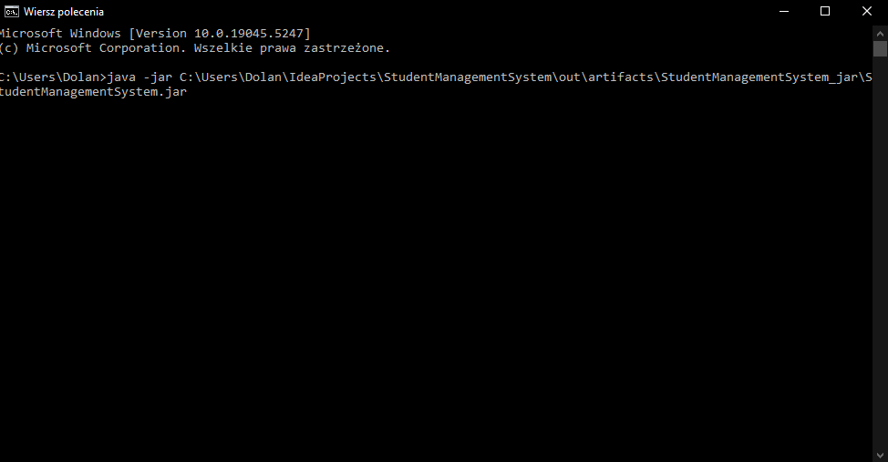
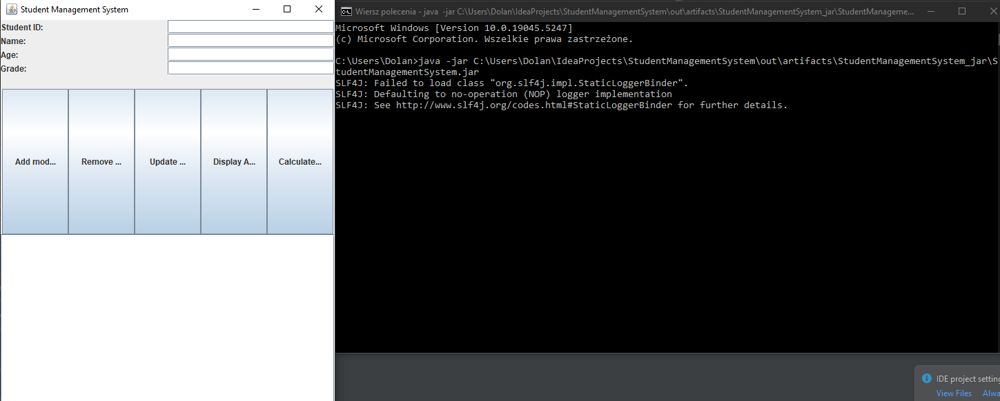

# System Zarządzania Studentami

## Uruchamianie

1. Otworzyć wiersz poleceń
2. W wierszu polece wpisać: java -jar "ŚcieżkaDoPliku\StudentManagementSystem.jar"

### Przykład użycia:

### Po uruchomieniu taki powinien być rezultat:

## Funkcjonalność

#### Projekt oferuje użytkownikom interfejs, w którym mogą wykonać różne operacje w tabeli studentów.

#### Operacje te są realizowane poprzez interakcję z czterema polami tekstowymi, reprezentującymi dane studenta oraz pięcioma przyciskami:
1. #### Add Student - Dodaje nowego studenta do tabeli.
2. #### Remove Student - Usuwa istniejącego studenta z tabeli.
3. #### Update Student - Aktualizuje dane istniejącego studenta.
4. #### Display All Students - Wyświetla tabelę studentów.
5. #### Calculate Average - Wyświetla średnią ocen wszystkich studentów.

### Użytkownicy są informowani o wszelkich błędach walidacji pól, które mogłyby się zdarzyć oraz o rezultacie operacji.

#### Na start baza danych jest pusta